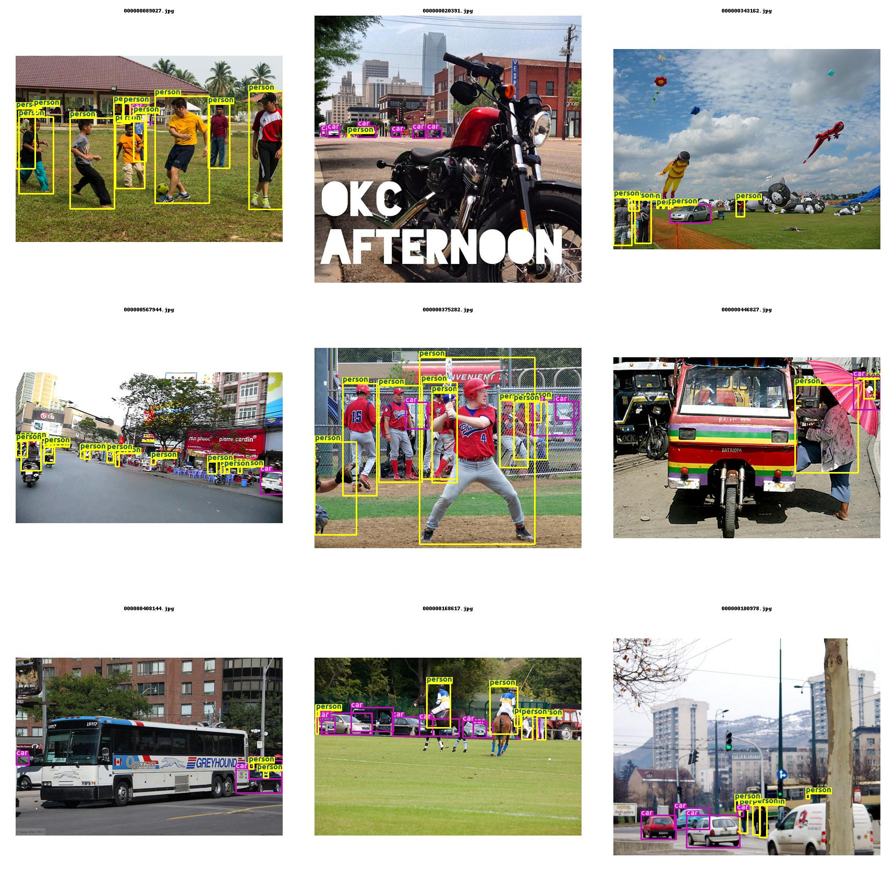

# labelvis
This is a small python utility to quickly visualize bounding-box annotations/labels before training models on the data.


## Installation

From PyPI
```
pip install labelvis
```

From source
```
git clone https://github.com/satheeshkatipomu/labelvis.git
cd labelvis
pip install -e .
```

## Usage
### COCO
```
from labelvis.labelvis import LabelVisualizer

imgs_path = "./images"
annotations_path = "./annotations/trainval.json"
annotations_format = "coco" #["coco","pascal","manifest","yolo","simple_json"]
img_size = 256
labelvis = LabelVisualizer(imgs_path,annotations_path,annotations_format,img_size=img_size)

num_images = 9 #Number Images to Visualize
labelvis.show_batch(num_imgs=num_images)

```
### Output
<p align="center"></p>

### Input format
#### Images

Common for all annotations formats.
```
imgs_path = "/path/to/images"

    /path/to/images
         |_ img001.jpg
         |_ img002.jpg
         |_ img003.jpg
     ...
```
#### Annotations
##### COCO (x,y,w,h)
```
annotations_path = "/path/to/annotations/annotations.json"
```
##### Pascal
```
annotations_path = "/path/to/annotations"
    /path/to/annotations
         |_ img001.xml
         |_ img002.xml
         |_ img003.xml
         ...
```
##### Manifest (output from AWS Sagemaker groundtruth)
```
annotations_path = "/path/to/annotations/output.manifest"
```
##### Yolo
```
annotations_path = "/path/to/annotations"
    /path/to/annotations
         |_ img001.txt
         |_ img002.txt
         |_ img003.txt
         ...
```
##### Simple JSON
```

annotations_path = "/path/to/simple.json"
{
    "image1.jpg": [
        {
            "bbox": [100, 11, 452, 332],
            "confidence": 0.982,
            "classname": "label1"
        },

        {
            "bbox": [200, 0, 356, 89],
            "confidence": 0.76,
            "classname": "label2"
        },

    ],

    "image2.jpg": [
        {
            "bbox": [145, 120, 387, 221]
            "confidence": 0.87,
            "classname": "label2"
        }
    ],
...

}


```

### Filters
```show_only_images_with_labels```
```
#Load visualizer with any format
from labelvis.labelvis import LabelVisualizer
imgs_path = "../test/"
annotations_path = "./simple.json"
annotations_format = "simple_json" #["coco","pascal","manifest","yolo","simple_json"]
img_size = 1024
labelvis = LabelVisualizer(imgs_path,annotations_path,annotations_format,img_size=img_size)

#Show batch
num_images = 9 #Number Images to Visualize
labelvis.show_batch(num_imgs=num_images,show_only_images_with_labels=True) #Shows images with atleast one annotation.
```

```show_only_images_with_no_labels```
```
#Load visualizer with any format
from labelvis.labelvis import LabelVisualizer
imgs_path = "../test/"
annotations_path = "./simple.json"
annotations_format = "simple_json" #["coco","pascal","manifest","yolo","simple_json"]
img_size = 1024
labelvis = LabelVisualizer(imgs_path,annotations_path,annotations_format,img_size=img_size)

#Show batch
num_images = 9 #Number Images to Visualize
labelvis.show_batch(num_imgs=num_images,show_only_images_with_no_labels=True) #Shows images with  no annotation.
```

```filter_categories```
```
#Load visualizer with any format
imgs_path = "./images/"
annotations_path = "./output.manifest"
annotations_format = "manifest" #["coco","pascal","manifest","yolo","simple_json"]
img_size = 512
labelvis = LabelVisualizer(imgs_path,annotations_path,annotations_format,img_size=img_size)

print(labelvis.dataloader.class_map)
{0: 'category1', 2: 'category2', 1: 'category3', 4: 'category4', 3: 'category5'}

#Show batch
num_images = 9 #Number Images to Visualize
labelvis.show_batch(num_imgs=num_images,filter_categories=[4,3]) #Shows images with only category 4 and 3 annotations.
```